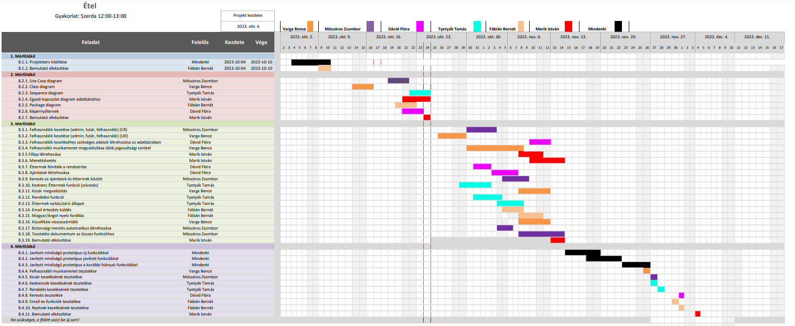

# Étel Projektterv 2023

## 1. Összefoglaló 

Az online étel rendelés mobilalkalmazáson keresztül az ember minden napi cselekvésévé vált. A kész étel kézhez kapása több időt szabadít fel más teendőkre. A projektnek a célja, hogy az éttermeknek, gyorséttermeknek egy összesített felületet tudjunk fenntartani. A felhasználók számára pedig egy olyan webalkalmazást fejlesszünk, amelyen a rendelő kényelmesen tudjon válogatni a az éttermek kínálata között, anélkül, hogy kimozduljon vagy egy webböngésző felületén több oldalon keresztül keresgéljen. A felhasználó egy letisztult felületen tudjon könnyen és gyorsan rendelni.

## 2. A projekt bemutatása

Ez a projektterv az Étel projektet mutatja be, amely 2023-09-25-től 2023-11-27-ig tart, azaz összesen 64 napon keresztül fog futni. A projekten hat fejlesztő fog dolgozni, a félév során négy alkalommal fogjuk prezentálni az előre haladásunkat a megrendelőnek, annak érdekében, hogy biztosítsuk a projekt folyamatos előrehaladását.

### 2.1. Rendszerspecifikáció

A rendszernek tudnia kell nyilvántartani az adott éttermek étlapját/kínálatát. Az éttermek nyitvatartási rendjétől kell függenie, hogy a felhasználó tud-e rendelni az adott étteremtől vagy nem. Ezenkívül a felhasználóknak a rendszer használata előtt fiókot kell létrehozniuk a saját adataikkal (név, e-mail cím, szállítás-és számlázási cím), tehát a rendszernek tárolnia kell a felhasználók adatait. A felhasználó keresgélni, böngészni tudjon az éttermek között és az éttermeken belüli étlapban is. A rendszer tudjon aktuális ajánlatokat feldobni a főoldalon. A futár valós időben való nyomon követése az alkalmazás felületén és a szállítási idő becslése. A fizetés előtt a kosár tartalmának ellenőrzésének lehetősége.

### 2.2. Funkcionális követelmények

 - Étlap/menü kezelése (CRUD)
 - Felhasználói adatok kezelése (CRUD) 
 - Rendelés kezelése (CRUD)
 - Kosár kezelése (CRUD)
 - Ajánlatok szeméyre szabása
 - Kedvenc éttermek kezelése
 - Email-es értesítések a fizetésről, a számláról
 - A szállítás megjelenítése a képernyőn a kezdőponttól a végpontig
 - Éttermek nyitvatartásának kezelése
 - Rendelés időzítése
 - Keresőmotor

### 2.3. Nem funkcionális követelmények

 - A kliens oldal böngészőfüggetlen legyen
 - Reszponzív megjelenés
 - A felhasználói adatok biztonságos tárolása
 - A legfrissebb technológiákat használja a rendszer
 - Angol, magyar nyelvű kezelőfelület
 - Letisztult, könnyen kezelhető főoldal

## 3. Költség- és erőforrás-szükségletek

Az erőforrásigényünk összesen 73 személynap, átlagosan 12 személynap/fő.

A rendelkezésünkre áll összesen 6 * 70 = 420 pont.

## 4. Szervezeti felépítés és felelősségmegosztás

A projekt megrendelője Dr. Kertész Attila. A Étel projektet a projektcsapat fogja végrehajtani, amely jelenleg hat fejlesztőből áll. A csapatban pályakezdő webprogramozók találhatók.

### 4.1 Projektcsapat

A projekt a következő emberekből áll:

| Név                    | Pozíció          |   E-mail cím (stud-os)        |
|------------------------|------------------|-------------------------------|
| Varga Bence Martin   | Projektmenedzser | h270444@stud.u-szeged.hu    |
| Fábián Bernát        | Projekt tag      | h259147@stud.u-szeged.hu    |
| Marik István         | Projekt tag      | h267445@stud.u-szeged.hu    |
| Mészáros Zsombor     | Projekt tag      | h267827@stud.u-szeged.hu    |
| Tyetyák Tamás        | Projekt tag      | h270076@stud.u-szeged.hu    |
| Dávid Flóra          | Projekt tag      | h257376@stud.u-szeged.hu    |

## 5. A munka feltételei

### 5.1. Munkakörnyezet

A projekt a következő munkaállomásokat fogja használni a munka során:

 - Munkaállomások: 6 db, Windows 10-es operációs rendszerrel
 - Huawei matebook 14s laptop (CPU: i5-11300H, RAM: 16 GB, GPU: Intel Iris Xe, SSD: 500 GB)
 - Asus Vivobook 15 laptop (CPU: i7-10510U, RAM: 8 GB, GPU: Nvidia GeForce MX250, SSD: 500 GB)
 - Lenovo ThinkPad P51 laptop (CPU: i7-7700HQ, RAM: 32GB, GPU: Intel HD Graphics 630, SSD: 500GB, HDD: 1 TB)
 - ASUS VivoBook 17 X712EA-AU693 laptop (CPU: i3-1115G4, RAM: 8 GB, GPU: Intel UHD Graphics, SSD: 256 GB)
 - Asztali számítógép (CPU: i7-7800, RAM: 16 GB, GPU: Nvidia GTX 1070 Ti , SSD: 250 GB, HDD 2 TB)
 - Asztali számítógép (CPU: i5-12400F, RAM: 16 GB, GPU: Nvidia GTX 1060, SSD: 128 GB, HDD: 1 TB)

A projekt a következő technológiákat/szoftvereket fogja használni a munka során: 

 - Heroku platformszolgáltatás a webalkalmazás hosztolásához
 - Heroku által biztosított PostgreSQL adatbázisszerver
 - Node.JS szoftverrendszer
 - Visual Studio Code fejlesztőkörnyezet
 - Git verziókövető (GitLab)
 

### 5.2. Rizikómenedzsment

| Kockázat                                    | Leírás                                                                                                                                                                                     | Valószínűség | Hatás  |
|---------------------------------------------|--------------------------------------------------------------------------------------------------------------------------------------------------------------------------------------------|--------------|--------|
| Betegség                                  | Súlyosságtól függően hátráltatja vagy bizonyos esetekben teljes mértékben korlátozza a munkavégzőt, így az egész projektre kihatással van. Megoldás: a feladatok átcsoportosítása        | nagy       | erős |
| Kommunikációs fennakadás a csapattagokkal | A csapattagok között nem elégséges az információ áramlás, nem pontosan, esetleg késve vagy nem egyértelműen tájékoztatjuk egymást. Megoldás: még gyakoribb megbeszélések és ellenőrzések | kis        | erős |
| ZH időszak                                | A ZH időszakok közben kevesebb idő jut a projektre, az egész csapatra hatással van. Megoldás: jó időbeosztás és megfelelő kommunikáció                                                | nagy       | közepes |
| Hardverprobléma                           | Előfordulhat, hogy egy csapattagnak elromlik a munkaeszköze. Megoldás: kölcsöneszköz használata, vagy ha nem tudja megoldani, akkor feladat átruházása                                 | kis        | erős |

## 6. Jelentések

### 6.1. Munka menedzsment
A munkát Varga Bence Martin koordinálja. Fő feladata, hogy folyamatosan egyeztessen a csapattagokkal az előrehaladásról és a fellépő problémákról, esetlegesen a megoldásban is segítséget nyújhat a projekt csúszásának elkerülése végett. További feladata a heti szinten tartandó csoportgyűlések időpontjának leszervezése, erről Discordon egyeztet a csapattal.

### 6.2. Csoportgyűlések

A projekt hetente ülésezik, hogy megvitassák az azt megelőző hét problémáit, illetve hogy megbeszéljék a következő hét feladatait. A megbeszélésről minden esetben memó készül.

1. megbeszélés:
 - Időpont: 2023.10.05
 - Hely: Online
 - Résztvevők: Dávid Flóra, Fábián Bernát, Marik István, Mészáros Zsombor, Tyetyák Tamás, Varga Bence Martin
 - Érintett témák: Projekttéma főbb feladatai, szerepek kiosztása

2. megbeszélés:
- Időpont: 2023.10.14
 - Hely: Online
 - Résztvevők: Dávid Flóra, Fábián Bernát, Marik István, Mészáros Zsombor, Tyetyák Tamás, Varga Bence Martin
 Érintett témák: commit üzetek szabványosítás (használjunk #issue számot), térkép funkció (google map addolás probléma),második mérdfőldkő haladási irány meghatározása, tanulmányozni a példa fa struktúrát

3. megbeszélés:
- Időpont: 2023.10.21
 - Hely: Online
 - Résztvevők: Dávid Flóra, Fábián Bernát, Marik István, Mészáros Zsombor, Tyetyák Tamás, Varga Bence Martin
 Érintett témák: UML és képernyőtervek átbeszélése

4. megbeszélés:
- Időpont: 2023.10.26
 - Hely: Online
 - Résztvevők: Dávid Flóra, Fábián Bernát, Marik István, Mészáros Zsombor, Tyetyák Tamás, Varga Bence Martin
 Érintett témák: Node.js beüzemelése, felmerült problémák megbeszélése

5. megbeszélés:
- Időpont: 2023.11.04
 - Hely: Online
 - Résztvevők: Dávid Flóra, Fábián Bernát, Marik István, Mészáros Zsombor, Tyetyák Tamás, Varga Bence Martin
 Érintett témák: M3 terv átbeszélése

 6. megbeszélés:
- Időpont: 2023.11.11
 - Hely: Online
 - Résztvevők: Dávid Flóra, Fábián Bernát, Marik István, Mészáros Zsombor, Tyetyák Tamás, Varga Bence Martin
 Érintett témák: Tesztelések átbeszélése

5. megbeszélés:
 - Időpont: 2023.11.04
 - Hely: Online
 - Résztvevők: Dávid Flóra, Fábián Bernát, Marik István, Mészáros Zsombor, Tyetyák Tamás, Varga Bence Martin
 - Érintett témák: M3 terv átbeszélése

6. megbeszélés:
 - Időpont: 2023.11.11
 - Hely: Online
 - Résztvevők: Dávid Flóra, Fábián Bernát, Marik István, Mészáros Zsombor, Tyetyák Tamás, Varga Bence Martin
 - Érintett témák: Tesztelések átbeszélése

7. megbeszélés:
 - Időpont: 2023.11.17
 - Hely: Online
 - Résztvevők: Dávid Flóra, Fábián Bernát, Marik István, Mészáros Zsombor, Tyetyák Tamás, Varga Bence Martin
 - Érintett témák: M4 tervek átbeszélése

8. megbeszélés:
 - Időpont: 2023.11.24
 - Hely: Online
 - Résztvevők: Dávid Flóra, Fábián Bernát, Marik István, Mészáros Zsombor, Tyetyák Tamás, Varga Bence Martin
 - Érintett témák: M4 tesztelések/megvalósitandó funkciók részletes átbeszélése 

8. megbeszélés:
 - Időpont: 2023.12.02
 - Hely: Online
 - Résztvevők: Dávid Flóra, Fábián Bernát, Marik István, Mészáros Zsombor, Tyetyák Tamás, Varga Bence Martin
 - Érintett témák: Utolsó teendők kiosztása, egyéb kérdések megválaszolása 

### 6.3. Minőségbiztosítás

Az elkészült terveket a terveken nem dolgozó csapattársak közül átnézik, hogy megfelel-e a specifikációnak és az egyes diagramtípusok összhangban vannak-e egymással. A meglévő rendszerünk helyes működését a prototípusok bemutatása előtt a tesztelési dokumentumban leírtak végrehajtása alapján ellenőrizzük és összevetjük a specifikációval, hogy az elvárt eredményt kapjuk-e. További tesztelési lehetőségek: unit tesztek írása az egyes modulokhoz vagy a kód közös átnézése (code review) egy, a vizsgált modul programozásában nem résztvevő csapattaggal. Szoftverünk minőségét a végső leadás előtt javítani kell a rendszerünkre lefuttatott kódelemzés során kapott metrikaértékek és szabálysértések figyelembevételével.
Az alábbi lehetőségek vannak a szoftver megfelelő minőségének biztosítására:
- Specifikáció és tervek átnézése (kötelező)
- Teszttervek végrehajtása (kötelező)
- Unit tesztek írása (választható)
- Kód átnézése (választható)

### 6.4. Átadás, eredmények elfogadása

A projekt eredményeit a megrendelő, Dr. Kertész Attila fogja elfogadni. A projektterven változásokat csak a megrendelő írásos engedélyével lehet tenni. A projekt eredményesnek bizonyul, ha specifikáció helyes és határidőn belül készül el. Az esetleges késések pontlevonást eredményeznek. 
Az elfogadás feltételeire és beadás formájára vonatkozó részletes leírás a következő honlapon olvasható: https://okt.inf.szte.hu/rf1/

### 6.5. Státuszjelentés

Minden mérföldkő leadásnál a projekten dolgozók jelentést tesznek a mérföldkőben végzett munkájukról a a megadott sablon alapján. A gyakorlatvezetővel folytatott csapatmegbeszéléseken a csapat áttekintik és felmérik az eredményeket és teendőket. Továbbá gazdálkodnak az erőforrásokkal és szükség esetén a megrendelővel egyeztetnek a projektterv módosításáról.

## 7. A munka tartalma

### 7.1. Tervezett szoftverfolyamat modell és architektúra

A szoftver fejlesztése során az agilis fejlesztési modellt alkalmazzuk, mivel a fejlesztés során nagy hangsúlyt fektetünk a folyamatos kommunikcióra. A fejlesztés során a szoftver specifikációi rugalmasan vátozhatnak, és ezzel a módszertannal tudunk a leggyorsabban alkalmazkodni az új elvárásokhoz.

A webalkalmazás az MVC (modell-view-controller) felépítést követi, a szerver és a kliens függetlenek, csupán API végpontok segítségével kommunikálnak.

### 7.2. Átadandók és határidők

A főbb átadandók és határidők a projekt időtartama alatt a következők:

| Szállítandó |                 Neve                                                        |   Határideje  |
|:-----------:|:---------------------------------------------------------------------------:|:-------------:|
|      D1     |      Projektterv és Gantt chart, prezentáció, egyéni jelentés               | 2023-10-10  |
|      D2     |      UML, adatbázis- és képernyőtervek, prezentáció, egyéni jelentés        | 2023-10-24  |
|    P1+D3    |      Prototípus I. és tesztelési dokumentáció, egyéni jelentés              | 2023-11-14  |
|    P2+D4    |      Prototípus II. és frissített tesztelési dokumentáció, egyéni jelentés  | 2023-12-05  |

D - dokumentáció, P - prototípus

## 8. Feladatlista

A következőkben a tervezett feladatok részletes összefoglalása található.

### 8.1. Projektterv (1. mérföldkő)

Ennek a feladatnak az a célja, hogy megvalósításhoz szükséges lépéseket, az erőforrásigényeket, az ütemezést, a felelősöket és a feladatok sorrendjét meghatározzuk, majd vizualizáljuk Gantt diagram segítségével.

Részfeladatai a következők:

#### 8.1.1. Projektterv kitöltése

Felelős: Mindenki

Tartam:  6 nap

Erőforrásigény:  1 személynap/fő

#### 8.1.2. Bemutató elkészítése

Felelős: Fábián Bernát

Tartam:  2 nap

Erőforrásigény:  0.5 személynap

### 8.2. UML és adatbázis- és képernyőtervek (2. mérföldkő)

Ennek a feladatnak az a célja, hogy a rendszerarchitektúrát, az adatbázist és webalkalmazás kinézetét megtervezzük.

Részfeladatai a következők:

#### 8.2.1. Use Case diagram

Felelős: Mészáros Zsombor

Tartam:  3 nap

Erőforrásigény:  1 személynap

#### 8.2.2. Class diagram

Felelős: Varga Bence

Tartam:  4 nap

Erőforrásigény:  1.5 személynap

#### 8.2.3. Sequence diagram

Felelős: Tyetyák Tamás

Tartam:  3 nap

Erőforrásigény:  1.5 személynap

#### 8.2.4. Egyed-kapcsolat diagram adatbázishoz

Felelős: Marik István

Tartam:  4 nap

Erőforrásigény:  1.5 személynap

#### 8.2.5. Package diagram

Felelős: Fábián Bernát

Tartam:  3 nap

Erőforrásigény:  1 személynap

#### 8.2.6. Képernyőtervek

Felelős: Dávid Flóra

Tartam:  3 nap

Erőforrásigény:  1.5 személynap

#### 8.2.7. Bemutató elkészítése

Felelős: Marik István

Tartam:  1 nap

Erőforrásigény:  0.5 személynap

### 8.3. Prototípus I. (3. mérföldkő)

Ennek a feladatnak az a célja, hogy egy működő prototípust hozzunk létre, ahol a vállalt funkcionális követelmények nagy része már prezentálható állapotban van. 

Részfeladatai a következők:

#### 8.3.1. Felhasználók kezelése (admin, futár, felhasználó) (CR)

Felelős: Mészáros Zsombor

Tartam:  5 nap

Erőforrásigény:  2 személynap

#### 8.3.2. Felhasználók kezelése (admin, futár, felhasználó) (UD)

Felelős: Varga Bence

Tartam:  4 nap

Erőforrásigény:  2 személynap

#### 8.3.3. Felhasználók kezeléséhez szükséges adatok létrehozása az adatbázisban

Felelős: Dávid Flóra

Tartam:  3 nap

Erőforrásigény:  1.5 személynap

#### 8.3.4. Felhasználói munkamenet megvalósítása több jogosultsági szinttel

Felelős: Varga Bence

Tartam:  10 nap

Erőforrásigény:  2 személynap

#### 8.3.5 Főlap létrehozása

Felelős: Marik István

Tartam:  4-6 nap

Erőforrásigény:  ~2.5 személynap

#### 8.3.6. Menetkövetés

Felelős: Marik István

Tartam:  3-5 nap

Erőforrásigény:  ~2 személynap

#### 8.3.7. Éttermek felvitele a rendszerbe

Felelős: Dávid Flóra

Tartam:  3 nap

Erőforrásigény:  1.5 személynap

#### 8.3.8. Ajánlatok létrehozása

Felelős: Dávid Flóra

Tartam:  3-5 nap

Erőforrásigény:  ~2 személynap

#### 8.3.9. Keresés az ajánlatok és éttermek között

Felelős: Mészáros Zsombor

Tartam:  4-5 nap

Erőforrásigény:  ~2 személynap

#### 8.3.10. Kedvenc Éttermek funkció

Felelős: Tyetyák Tamás

Tartam:  3-5 nap

Erőforrásigény:  ~2 személynap

#### 8.3.11. Kosár megvalósítás

Felelős: Varga Bence

Tartam:  3-5 nap

Erőforrásigény:  ~2 személynap

#### 8.3.12. Rendelési funkció

Felelős: Tyetyák Tamás

Tartam:  4-5 nap

Erőforrásigény:  ~2 személynap

#### 8.3.13. Éttermek nyitás/záró állapot

Felelős: Tyetyák Tamás

Tartam:  3-5 nap

Erőforrásigény:  ~2 személynap

#### 8.3.14. Email értesítés küldés

Felelős: Fábián Bernát

Tartam:  3-4 nap

Erőforrásigény:  ~1.5 személynap

#### 8.3.15. Magyar/Angol nyelv fordítás

Felelős: Fábián Bernát

Tartam:  3-4 nap

Erőforrásigény:  1.5 személynap

#### 8.3.16. Kiszállítási visszaszámláló

Felelős: Varga Bence

Tartam:  3-5 nap

Erőforrásigény:  ~2 személynap

#### 8.3.17. Biztonsági mentés automatikus létrehozása

Felelős: Mészáros Zsombor

Tartam:  3 nap

Erőforrásigény:  1 személynap

#### 8.3.18. Tesztelési dokumentum az összes funkcióhoz (TP, TC)

Felelős: Mészáros Zsombor

Tartam:  7 nap

Erőforrásigény:  ~2-3 személynap

#### 8.3.19. Bemutató elkészítése 

Felelős: Marik István

Tartam:  1-2 nap

Erőforrásigény:  1 személynap

### 8.4. Prototípus II. (4. mérföldkő)

Ennek a feladatnak az a célja, hogy az előző mérföldkő hiányzó funkcióit pótoljuk, illetve a hibásan működő funkciókat és az esetlegesen felmerülő új funkciókat megvalósítsuk. Továbbá az alkalmazás alapos tesztelése is a mérföldkőben történik az előző mérföldkőben összeállított tesztesetek alapján.

Részfeladatai a következők:

#### 8.4.1. Javított minőségű prototípus új funkciókkal

Felelős: Mindenki

Tartam:  5 nap

Erőforrásigény:  ~1.5 személynap/fő

#### 8.4.2. Javított minőségű prototípus javított funkciókkal

Felelős: Mindenki

Tartam:  5 nap

Erőforrásigény:  ~ 1 személynap/fő

#### 8.4.3. Javított minőségű prototípus a korábbi hiányzó funkciókkal

Felelős: Mindenki

Tartam:  5 nap

Erőforrásigény:  ~1 személynap/fő

#### 8.4.4. Felhasználói munkamenet tesztelése (TR)

Felelős: Varga Bence

Tartam:  1 nap

Erőforrásigény:  1 személynap

#### 8.4.5. Kosár kezelésének tesztelése (TR)

Felelős: Mészáros Zsombor

Tartam:  1 nap

Erőforrásigény:  1 személynap

#### 8.4.6. Kedvencek kezelésének tesztelése (TR)

Felelős: Tyetyák Tamás

Tartam:  1 nap

Erőforrásigény:  1 személynap

#### 8.4.7. Rendelés kezelésének tesztelése (TR)

Felelős: Tyetyák Tamás

Tartam:  1 nap

Erőforrásigény:  1 személynap

#### 8.4.8. Keresés tesztelése (TR)

Felelős: Dávid Flóra

Tartam:  1 nap

Erőforrásigény:  1 személynap

#### 8.4.9. Email-es funkciók tesztelése (TR)

Felelős: Fábián Bernát

Tartam:  1 nap

Erőforrásigény:  1 személynap

#### 8.4.10. Nyelvek kezelésének tesztelése (TR)

Felelős: Fábián Bernát

Tartam:  1 nap

Erőforrásigény:  1 személynap

#### 8.4.11. Bemutató elkészítése

Felelős: Marik István

Tartam:  1 nap

Erőforrásigény:  1 személynap

## 9. Részletes időbeosztás

## 10. Projekt költségvetés

### 10.1. Részletes erőforrásigény (személynap)

| Név          |   M1  |   M2  |   M3 |   M4  | Összesen |
|--------------|-------|-------|------|-------|----------|
| Varga Bence | 1 | 1.5 | 8 | 3.5 | 14     |
| Marik István | 1 | 2 | 5.5 | 3.5 | 12     |
| Dávid Flóra   | 1   | 1.5 | 5 | 3.5 | 11     |
| Fábián Bernát   | 1.5 | 1 | 3 | 4.5 | 10     |
| Mészáros Zsombor| 1   | 1 | 7.5 | 3.5 | 13     |
| Tyetyák Tamás   | 1   | 1.5 | 6 | 4.5 | 13     |

### 10.2. Részletes feladatszámok

| Név          |   M1  |   M2  |   M3 |   M4 | Összesen |
|--------------|-------|-------|------|------|----------|
| Varga Bence | 1 | 1 | 4 | 4   | 10     |
| Marik István | 1   | 2 | 3 | 4   | 10     |
| Dávid Flóra   | 1   | 1 | 3 | 4 | 9     |
| Fábián Bernát   | 2   | 1 | 2 | 5 | 10     |
| Mészáros Zsombor   | 1 | 1 | 4 | 4 | 10     |
| Tyetyák Tamás   | 1   | 1 | 3 | 5 | 10     |

### 10.3. Részletes költségvetés

| Név                                 | M1      | M2       | M3       | M4       | Összesen  |
|-------------------------------------|---------|----------|----------|----------|-----------|
| Maximálisan megszerezhető pontszám  |  (7)    | (20)     | (35)     |  (28)    | 100% (70) |
| Varga Bence                       | 5     | 15     | 35     |  15    | 70        |
| Marik István                      | 5     | 20     | 25     |  20    | 70        |
| Dávid Flóra                       | 5     | 20     | 25     |  20    | 70        |
| Fábián Bernát                     | 7     | 13     | 22     |  28    | 70        |
| Mészáros Zsombor                  | 5     | 10     | 30     |  25    | 70        |
| Tyetyák Tamás                     | 5     | 15     | 25     |  25    | 70        |

Szeged, 2023-10-04.
